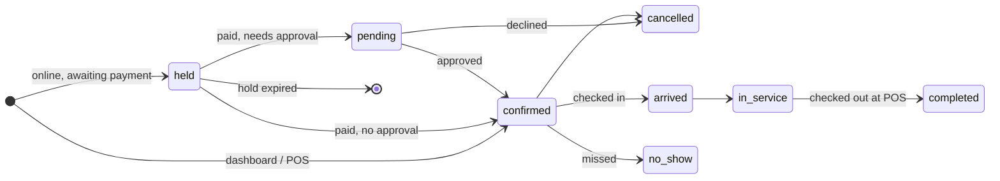

# Service bookings, end to end

**Design doc · Store** · Scripe web & backend · Status: draft for review, all decisions agreed · 27 Sept 2026

Make Scripe work end to end for businesses that sell appointments (salons, barbers, spas, physiotherapy and health practices) by filling the gaps in features every business already has. Nothing is renamed and nothing becomes type-specific. Staff are individually bookable from the first release.

## Contents

1. [Summary](#summary)
2. [Existing bookings work (0056/0057)](#existing-bookings-work-00560057)
3. [End-to-end journey](#end-to-end-journey)
4. [Services](#services)
5. [Team & schedules](#team--schedules)
6. [Booking engine](#booking-engine)
7. [Deposits & policies](#deposits--policies)
8. [Bookings page](#bookings-page)
9. [Checkout at POS](#checkout-at-pos)
10. [Online booking](#online-booking)
11. [Reminders](#reminders)
12. [Clients & packages](#clients--packages)
13. [Reporting](#reporting)
14. [Health practices](#health-practices)
15. [Build order](#build-order)
16. [Decisions](#decisions)
17. [Cleanup to do alongside](#cleanup-to-do-alongside)

## Summary

Today a business can create a `service` product, but it can't be run end to end: the duration and location a merchant enters are not saved on the product, there is no calendar, no way to choose a staff member, nothing prevents double-booking, and the **Store → Bookings** link falls through to the store overview because the old booking screens were removed on 22 Sept for a rethink. A first booking backend landed on 27 Sept (see the next section); this plan builds on it rather than alongside it.

This plan evolves the **bookings** domain and adds a small number of fields and screens, and leans on what already exists: products, variants and modifiers for the service menu; locations for branches; members and payroll for staff; orders, checkout and POS for payment; communications and jobs for reminders; customers for client records.

**Principles**

- **No verticals.** Every business sees the same features. A salon and a supermarket use the same Products, POS and Bookings.
- **Fill gaps, don't rename.** Services stay products, add-ons stay modifiers, branches stay locations. Changes are additive.
- **Staff are bookable.** Customers can pick a person, or "anyone available". Availability is per staff member, per location.
- **Calendar first.** The business needs to see and run bookings before customers can make them online.

## Existing bookings work (0056/0057)

On 27 Sept, migrations `0056_app_bookings` and `0057_app_scheduling` added a first booking backend, aimed at restoring the screens removed on 22 Sept:

- `app.bookings`: one service product per booking; `bookingDate` plus `startTime`/`endTime` as text; customer name, email and phone; statuses `pending | confirmed | declined | rescheduled | completed | cancelled | no_show`; optional `orderId`.
- `app.availability_profiles` and `app.event_types`: business-level weekly availability and Calendly-style event types, with most settings in a `data` jsonb.
- Endpoints: public `POST /api/store/bookings/reserve`; `GET /api/store/bookings`, `PATCH /api/store/bookings/:id/status`; CRUD for `/api/availability` and `/api/scheduling/event-types`; `GET /api/scheduling/bookings` (returns an empty list for now).

**How this plan relates to it.** The two overlap, and Scripe should have one booking system, not two. The existing work is a useful start (the table, the public reserve action, the status lifecycle), but it differs from this plan in ways that are expensive to change later:

| | This plan | 0056/0057 as built |
|---|---|---|
| Who is booked | Individual staff, with their own services and hours | The business; no staff |
| Service settings | On the product (`product_service_settings`) | Separate event types, settings in jsonb |
| One visit, several services | `booking_items` | One product per booking |
| Double-booking | Prevented by a database exclusion constraint | Not prevented |
| Time | `startsAt`/`endsAt` in UTC | Date plus text times |
| Tenant isolation | Row-level security like every other table | Tables deliberately outside RLS; checks only in the service layer |

**Proposed path:** keep `app.bookings` and its endpoints as the starting point, and evolve them in Phase 1 with forward migrations rather than a parallel table:

1. Add `startsAt`/`endsAt` (UTC), `locationId`, `source`, `holdExpiresAt` and `manageToken`; backfill from `bookingDate`/`startTime`/`endTime` and the store's time zone; then drop the text columns.
2. Add `booking_items` (with `staffId`) and move `productId`/`durationMinutes` onto items.
3. Put `bookings` and the new tables under RLS like the rest of the schema; handle public reserve through a narrowly scoped security-definer function, the pattern already used for webhook reconciliation.
4. Replace `event_types` with `product_service_settings`, and `availability_profiles` with per-staff `staff_schedules` (a profile can seed a staff member's week during migration).
5. Keep the reserve → confirm/decline → complete lifecycle and the endpoint paths where they still fit, so the frontend work already done carries over.

The frontend restoration of `BookingsManager` and the event-type wizard should pause until Phase 1 settles the model, so it isn't built twice.

## End-to-end journey

One service business from setup to repeat visit. Each step names what already exists and what is missing.

Labels: **Reuse** = exists and is used as-is · **Extend** = exists, gains fields or behaviour · **New** = does not exist yet

| # | Step | Built on | Gap to fill | Also helps |
|---|---|---|---|---|
| 1 | Set up services | **Extend** · Products (`service` type), variants, modifiers, categories | Save duration, buffers, notice and booking rules. Modifiers can add time. | Prep time on made-to-order items |
| 2 | Set up team | **Extend** · Members, payroll people, locations | Who performs which service, working hours, time off, per location | Staff rotas for any shop |
| 3 | Take bookings in-house | **New** · Bookings page | Calendar by staff, quick book, reschedule, statuses, walk-in queue | Pickups and appointments for any business |
| 4 | Customers book online | **Extend** · Storefront, checkout sessions | Pick staff and time on a service page, pay a deposit or in full | Online pre-orders with collection times |
| 5 | Remind and confirm | **Reuse** · Communications (WhatsApp, SMS, email), jobs | Booking templates and scheduled sends | Order-ready and pickup reminders |
| 6 | Visit and checkout | **Extend** · POS, registers, orders, payments | Open a booking at the till, add retail items and tips, net off the deposit | Tips at any POS |
| 7 | Client records | **Extend** · Customers (parties), CRM | Notes, visit history, preferred staff | Customer notes for any business |
| 8 | Repeat visits | **New** · Packages | Prepaid bundles such as 10 physio sessions | Prepaid bundles of any product |
| 9 | Reporting and pay | **Extend** · Analytics, payroll | Utilisation, no-shows, revenue and commission per staff member | Sales-by-staff for retail |

## Services

### A service is a product with booking settings · Extend

Builds on `products`, `product_variants`, `modifier_groups` / `modifier_options`, `product_location_settings`.

The product form already asks for a duration and a location type (Zoom, in person, phone…), but the backend has nowhere to store them. Add a settings table that applies to any product with `productType = 'service'`:

```text
-- one row per service product
product_service_settings
  productId              uuid   pk, fk products
  durationMinutes        int    required
  bufferBeforeMinutes    int    default 0   -- set-up
  bufferAfterMinutes     int    default 0   -- clean-up
  minNoticeMinutes       int    default 0   -- "book at least 2h ahead"
  maxAdvanceDays         int    default 60
  slotIntervalMinutes    int    default 15  -- start times offered
  locationType           text   in_person | at_customer | online | phone
  requiresApproval       bool   default false
  depositRule            jsonb  none | fixed | percent  (see Deposits)
  cancellationWindowMin  int    default 1440
```

- **Pricing by who performs it** uses variants as they are: "Haircut · Senior stylist ₦15,000" and "Haircut · Junior stylist ₦8,000". A variant can override the duration.
- **Add-ons** use modifiers as they are, with one new optional column, `modifier_options.extraDurationMinutes`, so "Beard trim +₦3,000" also adds 15 minutes to the booking.
- **Where it's offered** uses `product_location_settings.isAvailable`, which already exists per location.
- Group sessions (classes) are out of scope for the first release; capacity is one client per staff member per slot.

**Also helps:** `extraDurationMinutes` on modifiers gives made-to-order food a real prep-time estimate.

## Team & schedules

### Bookable staff · New

Builds on `business_memberships`, payroll people (`parties`), `locations`.

Staff today are `business_memberships`, which require a Scripe login. Many stylists and barbers will never log in, but payroll already records people as `parties`. A bookable staff profile links to whichever exists:

```text
staff_profiles
  id               uuid pk
  membershipId     uuid null   -- has a login
  partyId          uuid null   -- payroll person, no login
  displayName      text        -- shown to customers
  photoUploadId    uuid null
  isBookable       bool
  check: membershipId or partyId is set

staff_services        -- who can perform what
  staffId, productId, variantId null, durationOverride null

staff_schedules       -- weekly hours, per location
  staffId, locationId, weekday, startsAt, endsAt   -- local time

schedule_exceptions   -- time off, holidays, extra shifts
  staffId null, locationId null, startsAt, endsAt, kind (off | extra), reason
```

- Hours are stored in the location's local time and converted with its time zone (`Africa/Lagos` by default), so a 9–5 shift stays 9–5 across daylight-saving changes elsewhere.
- A `schedule_exceptions` row with no staff and a location closes the whole branch (public holidays).
- Settings gains a **Team** page: add a bookable person, pick their services, set their week and time off.

**Also helps:** any shop gets staff rotas and "who's on today", which POS shifts can read.

## Booking engine

### Bookings, slots and double-booking protection · Extend

Evolves the `bookings` domain from 0056 (see [Existing bookings work](#existing-bookings-work-00560057)); follows the permission, RLS and audit patterns of the other domains. Target shape:

```text
bookings
  id, businessId, locationId, customerPartyId
  status          held | pending | confirmed | arrived | in_service | completed | cancelled | no_show
  source          dashboard | pos | online | walk_in
  startsAt, endsAt              -- UTC, whole visit incl. buffers
  orderId null                  -- created when money is involved
  holdExpiresAt null            -- online checkout only
  manageToken                   -- customer's reschedule/cancel link
  notes, cancelledReason

booking_items     -- one visit, several services, back to back
  bookingId, position, productId, variantId, staffId
  startsAt, endsAt, modifierOptionIds[], priceMinor
```

- **Several services in one visit** ("cut, then colour") are separate `booking_items`, each with its own staff member and time, inside one booking.
- **Open slots** are computed on request: a staff member's schedule for the day, minus exceptions and existing items (with buffers), cut into start times at the service's interval, then filtered by notice and advance limits. "Anyone available" merges slots across every staff member who performs the service.
- **Double-booking** is prevented by the database, not by a check in code. An exclusion constraint on `(staffId, tstzrange(startsAt, endsAt))` for active statuses (via `btree_gist`) makes two overlapping items for the same person impossible, even when two customers click the same slot at the same moment.
- **Holds**: online bookings start as `held` with a 10-minute expiry while the customer pays, the same idea as `stock_reservations`. A job releases expired holds.



## Deposits & policies

### Money flows through orders · Extend

Builds on `orders` (`paymentStatus` already supports `partially_paid`), `checkout_sessions`, Paystack/Flutterwave webhooks, returns.

- A booking that takes money creates an order with one line per `booking_item`. Paying a deposit leaves the order `partially_paid`; the balance is collected at the POS.
- Deposit rule per service: none, a fixed amount, or a percentage. The online flow charges the deposit; bookings made in the dashboard can take it later or skip it.
- Cancellation inside the service's window, or a no-show, can keep the deposit. Cancelling earlier refunds it through the existing returns and refunds path.
- The payment webhook confirms a held booking, the same way it captures a checkout today.

## Bookings page

### Store → Bookings · New

Replaces the dead link in the Store sidebar; the product-level Bookings tab moves to the new API.

- **Calendar**: day and week views, one column per staff member, filtered by location. Click an empty slot to book; drag to move; colour by status. Time off and closed hours are shaded.
- **Quick book**: customer (search or add), services, staff, time. It suggests the next open slot when the chosen one is taken.
- **Walk-ins**: a queue beside the calendar with estimated waits, for barbers and walk-in clinics. Starting a walk-in puts it on the calendar as `in_service`.
- **List**: upcoming, pending approval, today, past; filters by staff, service and status.
- **Booking panel**: details, notes, reschedule, cancel, check in, mark no-show, open at POS.

## Checkout at POS

### A booking becomes a sale · Extend

Builds on POS, registers, register shifts, orders, payments.

- **Open booking** loads today's arrived and in-service bookings; selecting one fills the cart with its services and add-ons, attached to the booking's order.
- Staff can add retail products (shampoo, supplements) and a **tip**, which is attributed to the staff member who performed the service.
- Any deposit already paid is shown and deducted. Completing payment marks the booking `completed`.

**Also helps:** tips and "served by" on every POS sale.

## Online booking

### Book from the storefront · Extend

Builds on the storefront, product pages and checkout sessions.

1. Service page shows duration, price and add-ons.
2. Choose a staff member (photo and name) or "Anyone available".
3. Pick a date and a time from real open slots.
4. Enter name, phone and email; the phone number matches or creates the customer.
5. Pay the deposit or the full price (skipped when the service takes no deposit).
6. Confirmation page and message, with a link to reschedule or cancel inside the policy.

Public endpoints need no login and are rate-limited: list bookable services, list slots for a date range, create a hold, and manage a booking with its `manageToken`.

## Reminders

### Confirmations and reminders · Reuse

Builds on `communication_templates`, `communication_messages`, credits, opt-outs, and the `jobs` system.

- Messages on confirm, reschedule, cancel and approval, plus reminders 24 hours and 2 hours before (configurable).
- WhatsApp and SMS by default, email as well. Sends draw on the business's existing communication credits and respect opt-outs.
- Reminders are scheduled jobs created when a booking is confirmed and cancelled when it moves or is cancelled.
- A calendar invite (.ics) is attached to email confirmations.

## Clients & packages

### Client records · Extend

Builds on `parties`, `customer_accounts`, CRM.

- Customer profile gains **notes** (staff-only, e.g. "sensitive scalp", "uses a #2 guard"), **preferred staff**, and a **visit history** built from bookings and orders.
- The online flow and quick book both match customers by phone number first, so one person doesn't become three records.

### Packages · New

- A package is a product that grants a number of sessions of one or more services, with an optional expiry: "10 physio sessions, 6 months".
- Buying one creates a balance on the customer; booking a covered service draws from it instead of charging.

**Also helps:** prepaid bundles of anything, such as "10 coffees".

## Reporting

### Staff and booking reports · Extend

Builds on analytics and `payroll_items` (which already reference people as parties).

- Bookings by status, no-show and cancellation rates, busiest hours, and **utilisation** (booked time ÷ scheduled time) per staff member.
- Revenue and tips per staff member.
- Optional **commission** per staff member (percentage of service revenue), which can feed a payroll run as an item.

## Health practices

### An optional layer, later · New

Physiotherapy and clinics need everything above, plus records that fall under Nigeria's data protection law (NDPA). These attach to existing customers and bookings rather than forming a separate product.

- **Intake forms and consent** sent before the first visit, stored against the customer.
- **Session notes** per booking (e.g. SOAP format) and **treatment plans** across visits, which pair naturally with packages.
- **Protection**: notes encrypted at rest with the field encryption built for KYB, readable only by the treating practitioner and roles with explicit permission, and every read written to the audit log.
- HMO and insurance billing are not planned.

## Build order

Each phase ships something usable on its own. Sizes are rough estimates for one engineer across both repos, including tests.

### Phase 1 — Foundation (~1.5 weeks)

- Service settings saved on products; modifier extra duration
- Staff profiles, staff-service links, weekly schedules, time off; Team settings page
- Evolve `app.bookings` from 0056 (UTC times, `booking_items`, RLS) and replace `event_types` / `availability_profiles`
- Slot calculation with exclusion-constraint protection, fully tested

*Done when a service's settings save and the API returns correct open slots per staff member.*

### Phase 2 — Bookings page & POS checkout (~1.5 weeks)

- Calendar, quick book, reschedule, statuses, list view
- Open a booking at POS; tips; deposits netted off
- Commission percentage per staff member, reported with revenue and tips
- Store → Bookings link points at the real page

*Done when a salon can run a full day from the dashboard and the till.*

### Phase 3 — Online booking & deposits (~1.5 weeks)

- Storefront booking flow, holds, deposit payment, webhook confirmation
- Customer reschedule and cancel link, cancellation policy, refunds

*Done when a customer can book, pay a deposit and reschedule without contacting the business.*

### Phase 4 — Reminders, walk-ins & reporting (~1 week)

- WhatsApp, SMS and email confirmations and reminders
- Walk-in queue; client notes, preferred staff, visit history
- Staff utilisation, no-shows, revenue and tips

### Phase 5 — Packages & payroll (~1 week)

- Session packages and balances; commission feeding payroll runs

### Phase 6 — Health layer (~2 weeks)

- Intake forms, consent, session notes, treatment plans, access controls and audit

Not planned yet: group classes with capacity, rooms and equipment as bookable resources, Google Calendar sync.

## Decisions

Agreed on 26 Sept 2026:

1. **Staff without a login — yes.** Bookable staff can be payroll people who never sign in (`staff_profiles.partyId`). Most stylists and barbers won't have Scripe accounts.
2. **Deposit default — none.** New services take no deposit; a single switch per service turns it on (fixed amount or percentage).
3. **Message costs — use credits.** Booking confirmations and reminders draw on the business's existing communication credits, with the count shown clearly in settings.
4. **Commission — from Phase 2.** A simple percentage of service revenue per staff member, reported alongside revenue and tips; feeding payroll runs follows in Phase 5.
5. **Plan access — not now.** Bookings is available on every plan with no limits. Plan gating for service bookings is deferred and out of scope for all phases here.

## Cleanup to do alongside

- **Store → Bookings** currently shows the store overview. Hide the link until Phase 2 lands.
- `StoreTypeStep.tsx` is no longer used anywhere and can be deleted.
- The product-level Bookings tab calls `/store/bookings`, which 0056 restored; it moves to the evolved endpoint shape in Phase 1.
- `ProductSettingsService.tsx` collects duration and location that the backend discards until Phase 1.
- Leftover scheduling entries in `agentPages.ts` and the "New event type" header action should be removed or pointed at the new pages once `event_types` is replaced.
